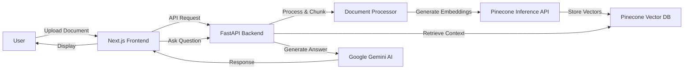

# 🚀 DJ RAG - Intelligent Document Analysis & Chat

<div align="center">


**Transform your static documents into intelligent, searchable knowledge bases with cutting-edge RAG technology**

[Features](#-features) • [Architecture](#-architecture) • [Installation](#-installation) • [Usage](#-usage) • [API](#-api-documentation) • [Implementation](#-implementation) • [Contributing](#-contributing)

</div>

---

## 📋 Overview

DJ RAG is a powerful Retrieval-Augmented Generation (RAG) application that enables users to upload documents (PDF, DOCX, Excel, CSV) and engage in intelligent, context-aware conversations about their content. Built with Next.js and FastAPI, it leverages Google's Gemini AI and Pinecone vector database for state-of-the-art document understanding.

### ✨ Key Highlights

- 🤖 **AI-Powered Conversations** - Natural language Q&A with your documents
- 📄 **Multi-Format Support** - PDF, DOCX, Excel (.xlsx), and CSV files
- ⚡ **Lightning Fast** - Sub-second response times with optimized vector search
- 🔒 **Privacy First** - Your data stays under your control
- 💬 **Context-Aware** - Maintains conversation history for follow-up questions
- 🎨 **Beautiful UI** - Modern, responsive design with smooth animations

---

## 🎯 Features

### Document Processing
- **Universal File Support**: Upload PDF, DOCX, Excel, and CSV files
- **Intelligent Chunking**: Smart document splitting for optimal retrieval
- **Semantic Search**: Hybrid vector + keyword search for accurate results
- **Session-Based Isolation**: Each chat maintains its own document context

### AI Capabilities
- **Google Gemini 2.5 Flash**: State-of-the-art language model
- **Pinecone Vector DB**: Scalable, high-performance vector storage
- **Llama Embeddings**: High-quality semantic embeddings
- **Context Retention**: Multi-turn conversations with full history

### User Experience
- **Smart Session Management**: Reuses empty sessions to prevent clutter
- **Real-time Chat**: Instant responses with streaming support
- **Responsive Design**: Works seamlessly on desktop and mobile
- **Dynamic Routing**: URL-based chat sessions for easy sharing

---

## 🏗 Architecture



### Tech Stack

#### Frontend
- **Framework**: Next.js 16.0 (React 19.2)
- **Styling**: Tailwind CSS 4.0
- **UI Components**: Radix UI
- **Animations**: Framer Motion
- **Icons**: Lucide React
- **Markdown**: React Markdown with syntax highlighting

#### Backend
- **Framework**: FastAPI
- **Database**: SQLite (SQLAlchemy ORM)
- **Vector Store**: Pinecone
- **LLM**: Google Gemini (via LangChain)
- **Embeddings**: Pinecone Llama Text Embeddings
- **Document Processing**: PyPDF, python-docx, pandas

---

## 🚀 Installation

### Prerequisites

- **Node.js** 18+ and npm
- **Python** 3.10+
- **Google API Key** (for Gemini)
- **Pinecone API Key** (for vector storage)

### 1. Clone the Repository

```bash
git clone https://github.com/DJ-InfinityCoder/RAG.git
cd RAG
```

### 2. Backend Setup

```bash
# Navigate to backend directory
cd backend

# Create virtual environment
python -m venv venv
source venv/bin/activate  # On Windows: venv\Scripts\activate

# Install dependencies
pip install -r requirements.txt

# Create .env file
cp .env.example .env
# Edit .env and add your API keys
```

**Required Environment Variables** (backend/.env):
```env
GOOGLE_API_KEY=your_google_api_key_here
PINECONE_API_KEY=your_pinecone_api_key_here
PINECONE_INDEX_NAME=djrag
```

### 3. Frontend Setup

```bash
# Navigate to frontend directory
cd ../frontend

# Install dependencies
npm install

# Start development server
npm run dev
```

### 4. Start the Application

**Terminal 1 - Backend:**
```bash
cd backend
python main.py
```
Server runs on `http://localhost:8000`

**Terminal 2 - Frontend:**
```bash
cd frontend
npm run dev
```
App runs on `http://localhost:3000`

---

## 📖 Usage

### 1. Create a Chat Session
- Click "Get Started" on the homepage
- A new chat session is created (or reuses an empty one)

### 2. Upload a Document
- Click the upload button in the chat interface
- Select a PDF, DOCX, Excel, or CSV file
- Wait for processing (automatic chunking and embedding)

### 3. Ask Questions
- Type your question in the chat input
- Get AI-powered answers based on your document
- Follow up with additional questions

### 4. Manage Sessions
- View all chats in the sidebar
- Switch between different document sessions
- Delete sessions when no longer needed

---

## 🔧 API Documentation

### Base URL
```
http://localhost:8000
```

### Endpoints

#### Health Check
```http
GET /health
```

#### Create Session
```http
POST /sessions
Content-Type: application/json

{
  "title": "New Chat"
}
```

#### List Sessions
```http
GET /sessions
```

#### Get Messages
```http
GET /sessions/{session_id}/messages
```

#### Upload Document
```http
POST /sessions/{session_id}/upload
Content-Type: multipart/form-data

file: <file>
```

#### Send Message
```http
POST /sessions/{session_id}/chat
Content-Type: application/json

{
  "question": "Your question here"
}
```

#### Delete Session
```http
DELETE /sessions/{session_id}
```

---

## 🗂 Project Structure

```
dj-rag/
├── backend/
│   ├── database.py          # Database configuration
│   ├── main.py             # FastAPI application
│   ├── models.py           # SQLAlchemy models
│   ├── rag_engine.py       # RAG logic and LangChain integration
│   ├── requirements.txt    # Python dependencies
│   └── .env.example        # Environment variables template
│
├── frontend/
│   ├── src/
│   │   ├── app/            # Next.js app directory
│   │   │   ├── page.tsx    # Homepage
│   │   │   ├── chat/[id]/  # Chat interface
│   │   │   ├── about/      # About page
│   │   │   ├── careers/    # Careers page
│   │   │   ├── privacy/    # Privacy policy
│   │   │   ├── terms/      # Terms of service
│   │   │   └── security/   # Security page
│   │   ├── components/     # React components
│   │   │   ├── Navbar.tsx
│   │   │   └── FloatingLines.tsx
│   │   └── lib/            # Utilities
│   ├── package.json        # Node dependencies
│   └── tailwind.config.ts  # Tailwind configuration
│
├── README.md                  # Project documentation
├── IMPLEMENTATION.md          # Detailed implementation guide
├── CONTRIBUTING.md            # Contribution guidelines
└── LICENSE                    # MIT License
```

---

## 📐 Implementation

For a comprehensive, detailed guide on how this project was built, including:

- Complete architecture breakdown
- Tech stack decisions and rationale
- Phase-by-phase implementation
- RAG engine internals
- Database schema design
- Data flow diagrams
- Challenges and solutions
- Performance optimizations

**See the [IMPLEMENTATION.md](IMPLEMENTATION.md) documentation**

---

## 🔐 Security

- All environment variables must be kept secure
- API keys should never be committed to version control
- Use `.env` files for local development
- Implement proper authentication for production deployments
- Document metadata is session-isolated in vector storage

---

## 🤝 Contributing

We welcome contributions! Please follow these steps:

1. Fork the repository
2. Create a feature branch (`git checkout -b feature/AmazingFeature`)
3. Commit your changes (`git commit -m 'Add some AmazingFeature'`)
4. Push to the branch (`git push origin feature/AmazingFeature`)
5. Open a Pull Request

### Development Guidelines

- Follow existing code style and conventions
- Add tests for new features
- Update documentation as needed
- Ensure all tests pass before submitting PR

---

## 📝 License

This project is licensed under the MIT License - see the [LICENSE](LICENSE) file for details.

---

## 🙏 Acknowledgments

- **Google Gemini** - Advanced language model
- **Pinecone** - Vector database infrastructure
- **LangChain** - RAG framework
- **Vercel** - Next.js framework
- **Radix UI** - Accessible component primitives

---

## 📧 Contact

- **Project Repository**: [https://github.com/DJ-InfinityCoder/RAG](https://github.com/DJ-InfinityCoder/RAG)
- **Issues & Support**: [GitHub Issues](https://github.com/DJ-InfinityCoder/RAG/issues)
- **Detailed Implementation**: [IMPLEMENTATION.md](IMPLEMENTATION.md)

---

<div align="center">

**Built with ❤️ for the future of AI-powered document interaction**

⭐ Star this repo if you find it helpful!

</div>
