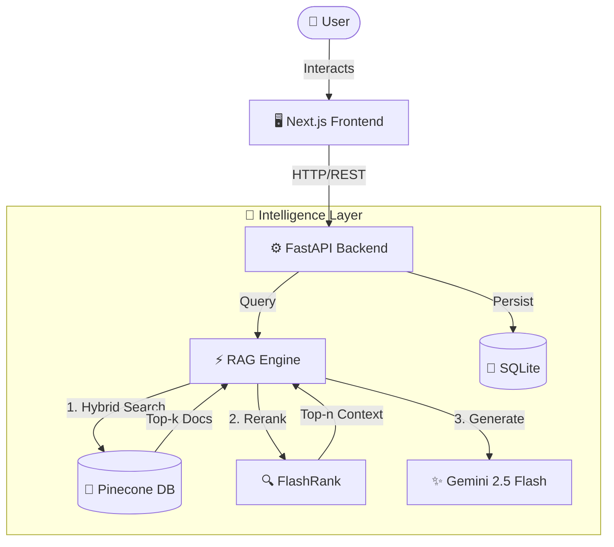

<div align="center">

# 🧠 DJ Rag
### Advanced Retrieval-Augmented Generation System

[](https://nextjs.org/)
[](https://fastapi.tiangolo.com/)
[](https://deepmind.google/technologies/gemini/)
[](https://www.pinecone.io/)
[](https://www.langchain.com/)

<p align="center">
  <a href="https://djrag.dilip.live"><strong>🚀 Live Demo</strong></a> •
  <a href="https://github.com/DJ-InfinityCoder/RagFrontend"><strong>�️ Frontend Repo</strong></a> •
  <a href="https://github.com/DJ-InfinityCoder/RagBackend"><strong>⚙️ Backend Repo</strong></a>
</p>

<br />

</div>

## 📖 Overview

**DJ Rag** is a production-grade Retrieval-Augmented Generation (RAG) application engineered for high-precision document analysis and intelligent Q&A. By combining the speed of **FastAPI** with the interactivity of **Next.js**, it delivers a seamless experience for querying complex documents.

Powered by **Google's Gemini 2.5 Flash** and **Pinecone Vector Database**, DJ Rag employs a sophisticated hybrid search strategy with **FlashRank** reranking to ensure the most relevant context is always retrieved.

---

## 🏗️ Architecture

The system is built on a decoupled microservices architecture:


```mermaid
graph TD
    User([👤 User]) -->|Interacts| Client[🖥️ Next.js Frontend]
    Client -->|HTTP/REST| API[⚙️ FastAPI Backend]
    
    subgraph "🧠 Intelligence Layer"
        API -->|Query| RAG[⚡ RAG Engine]
        RAG -->|1. Hybrid Search| Pinecone[(🌲 Pinecone DB)]
        Pinecone -->|Top-k Docs| RAG
        RAG -->|2. Rerank| FlashRank[🔍 FlashRank]
        FlashRank -->|Top-n Context| RAG
        RAG -->|3. Generate| Gemini[✨ Gemini 2.5 Flash]
        API -->|Persist| DB[(💾 SQLite)]
    end
```

---

## ✨ Key Features

| Feature | Description |
| :--- | :--- |
| **🧠 Intelligent Chat** | Context-aware conversations with streaming responses for real-time feedback. |
| **📄 Multi-Format Support** | Seamlessly ingest PDF, DOCX, PPTX, CSV, Excel, and TXT files. |
| **🔍 Advanced RAG** | Hybrid semantic search + FlashRank reranking for superior accuracy. |
| **⚡ Smart Chunking** | Optimized text splitting strategies to maximize context retention. |
| **📊 Live Metrics** | Real-time visibility into token usage, latency, and estimated costs. |
| **🛡️ Session Management** | Robust chat session handling with persistence and history management. |
| **🎨 Modern UI** | A premium, responsive interface built with Tailwind CSS and Framer Motion. |

---

## 🛠️ Technology Stack

### 🖥️ Frontend
*   **Framework:** Next.js (App Router)
*   **Styling:** Tailwind CSS, Framer Motion
*   **State:** SWR, React Hooks
*   **Icons:** Lucide React

### ⚙️ Backend
*   **Core:** FastAPI, Pydantic
*   **AI/ML:** LangChain, Google Gemini 2.5 Flash, FlashRank
*   **Database:** Pinecone (Vector), SQLite (Relational)
*   **Infrastructure:** Docker, Render (Backend), Vercel (Frontend)

---

## 🚀 Getting Started

### Prerequisites
*   Node.js 18+
*   Python 3.10+
*   API Keys: Google Gemini, Pinecone

### 1️⃣ Backend Setup

```bash
# Clone the backend repository
git clone https://github.com/DJ-InfinityCoder/RagBackend.git
cd RagBackend

# Create virtual environment
python -m venv venv
source venv/bin/activate  # Windows: venv\Scripts\activate

# Install dependencies
pip install -r requirements.txt

# Configure environment
echo "GOOGLE_API_KEY=your_key" >> .env
echo "PINECONE_API_KEY=your_key" >> .env
echo "PINECONE_INDEX_NAME=djrag" >> .env

# Start the server
python main.py
```

### 2️⃣ Frontend Setup

```bash
# Clone the frontend repository
git clone https://github.com/DJ-InfinityCoder/RagFrontend.git
cd RagFrontend

# Install dependencies
npm install

# Configure environment
echo "NEXT_PUBLIC_API_BASE_URL=http://localhost:8000" >> .env.local

# Start the development server
npm run dev
```

Visit `http://localhost:3000` to launch the application.

---

## 👨‍💻 Author

<div align="center">

**Dilip Meghwal**

[](https://dilip.live)
[](https://www.linkedin.com/in/dilip-maurya-58252a236/)
[](https://drive.google.com/file/d/1sjZU4XBlfpP_mToazGgdlv-J-odBw7pd/view)

</div>
