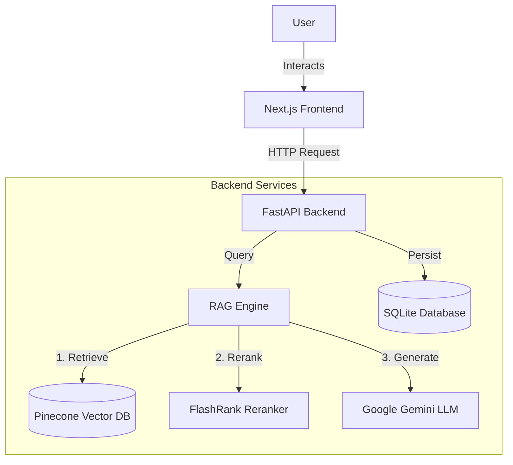

# DJ Rag - Advanced RAG Application

A production-grade Retrieval-Augmented Generation (RAG) application designed for efficient document analysis and intelligent Q&A. This project features a modern Next.js frontend and a robust FastAPI backend powered by Google Gemini and Pinecone.

[**🚀 Live Demo**](https://djrag.dilip.live) | [**📂 Frontend Repo**](https://github.com/DJ-InfinityCoder/RagFrontend) | [**📂 Backend Repo**](https://github.com/DJ-InfinityCoder/RagBackend)

## 🏗️ Architecture

The application is composed of two main services:

1.  **Frontend**: A responsive Next.js application providing the chat interface.
2.  **Backend**: A FastAPI service handling RAG logic, vector storage, and LLM interaction.


```mermaid
graph TD
    User[User] -->|Interacts| Client[Next.js Frontend]
    Client -->|HTTP Request| API[FastAPI Backend]
    
    subgraph "Backend Services"
        API -->|Query| RAG[RAG Engine]
        RAG -->|1. Retrieve| Pinecone[(Pinecone Vector DB)]
        RAG -->|2. Rerank| FlashRank[FlashRank Reranker]
        RAG -->|3. Generate| Gemini[Google Gemini LLM]
        API -->|Persist| DB[(SQLite Database)]
    end
```

## ✨ Features

- **Intelligent Chat**: Real-time Q&A with streaming responses.
- **Multi-Format Support**: Upload and analyze PDF, DOCX, PPTX, CSV, Excel, and TXT files.
- **Advanced RAG**:
    - **Hybrid Search**: Semantic search with Pinecone.
    - **Reranking**: FlashRank for high-precision context selection.
    - **Smart Chunking**: Optimized text splitting for better context retention.
- **Session Management**: Create, manage, and delete chat sessions.
- **Metrics**: Real-time display of response time, token usage, and estimated cost.
- **Responsive UI**: Built with Tailwind CSS and Framer Motion for a premium feel.

## 🛠️ Tech Stack

### Frontend
- **Framework**: [Next.js 16](https://nextjs.org/) (App Router)
- **Styling**: [Tailwind CSS](https://tailwindcss.com/)
- **State Management**: [SWR](https://swr.vercel.app/)
- **Icons**: [Lucide React](https://lucide.dev/)

### Backend
- **Framework**: [FastAPI](https://fastapi.tiangolo.com/)
- **LLM**: [Google Gemini 2.5 Flash](https://deepmind.google/technologies/gemini/)
- **Vector DB**: [Pinecone](https://www.pinecone.io/)
- **Orchestration**: [LangChain](https://www.langchain.com/)
- **Reranking**: [FlashRank](https://github.com/PrithivirajDamodaran/FlashRank)

## 🚀 Quick Start

### Prerequisites
- Node.js 18+
- Python 3.10+
- Pinecone API Key
- Google Gemini API Key

### 1. Backend Setup

```bash
cd RagBackend
python -m venv venv
source venv/bin/activate  # On Windows: venv\Scripts\activate
pip install -r requirements.txt

# Create .env file
echo "GOOGLE_API_KEY=your_key" >> .env
echo "PINECONE_API_KEY=your_key" >> .env
echo "PINECONE_INDEX_NAME=djrag" >> .env

python main.py
```

### 2. Frontend Setup

```bash
cd RagFrontend
npm install

# Create .env.local file
echo "NEXT_PUBLIC_API_BASE_URL=http://localhost:8000" >> .env.local

npm run dev
```

Visit `http://localhost:3000` to start using the application.

## 👨‍💻 Author

**Dilip Meghwal**

- [Portfolio](https://dilip.live)
- [LinkedIn](https://www.linkedin.com/in/dilip-maurya-58252a236/)
- [Resume](https://drive.google.com/file/d/1sjZU4XBlfpP_mToazGgdlv-J-odBw7pd/view)
