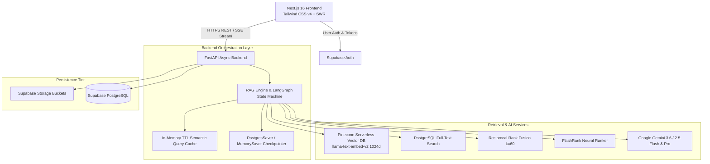
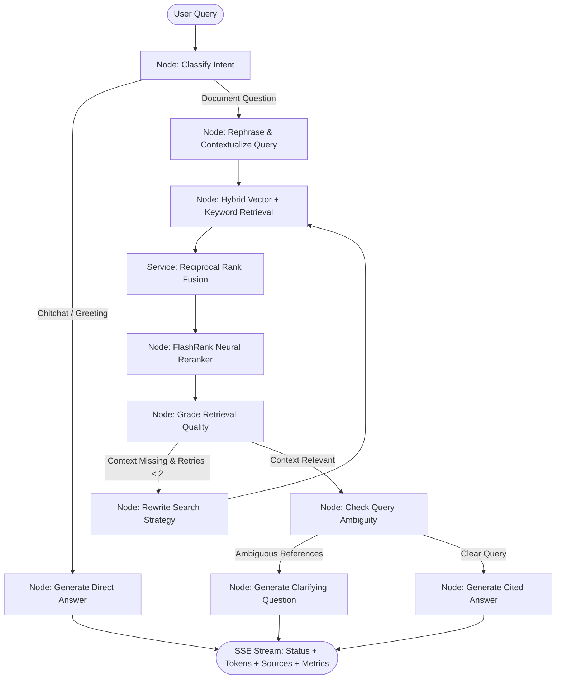

# AskDoc — Enterprise Document Intelligence & Hybrid RAG Platform

<div align="center">

[](https://nextjs.org/)
[](https://fastapi.tiangolo.com/)
[](https://www.langchain.com/langgraph)
[](https://deepmind.google/technologies/gemini/)
[](https://www.pinecone.io/)
[](https://supabase.com/)

**Production-grade, agentic Retrieval-Augmented Generation (RAG) platform combining an interactive Next.js 16 user interface with a 10-node cyclic LangGraph FastAPI backend. Features structure-aware document parsing, Reciprocal Rank Fusion (RRF), FlashRank neural reranking, Bring-Your-Own-Key (BYOK) Gemini execution, and automated LLM-as-a-judge evaluation.**

[Live Web Application](https://askdoc.dilip.website) • [GitHub Monorepo](https://github.com/DJ-InfinityCoder/RAG) • [Author Portfolio](https://dilipmeghwal.in)

</div>

---

## Table of Contents

- [Overview](#overview)
- [System Architecture](#system-architecture)
  - [Full-Stack Data Flow](#1-full-stack-data-flow)
  - [Agentic LangGraph Quality Loop](#2-agentic-langgraph-quality-loop)
- [Core Capabilities](#core-capabilities)
- [Monorepo Structure](#monorepo-structure)
- [Subsystems & Engineering Highlights](#subsystems--engineering-highlights)
  - [1. Structure-Aware Document Ingestion](#1-structure-aware-document-ingestion)
  - [2. Hybrid Retrieval & Reciprocal Rank Fusion (RRF)](#2-hybrid-retrieval--reciprocal-rank-fusion-rrf)
  - [3. FlashRank Neural Reranking](#3-flashrank-neural-reranking)
  - [4. Dynamic Bring-Your-Own-Key (BYOK) & Free Tier Quotas](#4-dynamic-bring-your-own-key-byok--free-tier-quotas)
  - [5. Checkpointer & Multi-Turn Conversation Memory](#5-checkpointer--multi-turn-conversation-memory)
  - [6. High-Performance TTL Query Response Cache](#6-high-performance-ttl-query-response-cache)
  - [7. LLM-as-a-Judge Evaluation Suite](#7-llm-as-a-judge-evaluation-suite)
  - [8. End-to-End Observability & LangSmith Tracing](#8-end-to-end-observability--langsmith-tracing)
- [Quick Start Guide](#quick-start-guide)
  - [Prerequisites](#prerequisites)
  - [1. Backend Setup](#1-backend-setup)
  - [2. Frontend Setup](#2-frontend-setup)
- [API Reference](#api-reference)
- [Automated Testing](#automated-testing)
- [Production Deployment](#production-deployment)
- [Author & Credits](#author--credits)

---

## Overview

**AskDoc** is a full-stack document intelligence platform designed to eliminate hallucinations and extract precise facts from complex enterprise documents (PDFs with merged multi-column tables, Word documents, PowerPoint presentations, Excel spreadsheets, CSVs, and raw text).

The application is architected as a monorepo consisting of:
1. **`RagFrontend`**: Modern Next.js 16 client with real-time Server-Sent Events (SSE) streaming, interactive citation inspector pills (`[1]`, `[2]`), BYOK modal configuration, and evaluation dashboards.
2. **`RagBackend`**: Async FastAPI service orchestrating a 10-node cyclic LangGraph state machine, dense vector search via Pinecone Inference (`llama-text-embed-v2`, 1024-dim), Postgres Full-Text Search, FlashRank neural reranking, and Supabase cloud storage.

---

## System Architecture

### 1. Full-Stack Data Flow


```mermaid
graph TD
    Client[Next.js 16 Frontend<br/>Tailwind CSS v4 + SWR] -->|HTTPS REST / SSE Stream| API[FastAPI Async Backend]
    Client -->|User Auth & Tokens| SupaAuth[Supabase Auth]
    
    subgraph "Backend Orchestration Layer"
        API --> Engine[RAG Engine & LangGraph State Machine]
        Engine --> Cache[In-Memory TTL Semantic Query Cache]
        Engine --> Checkpointer[PostgresSaver / MemorySaver Checkpointer]
    end
    
    subgraph "Retrieval & AI Services"
        Engine --> Dense[Pinecone Serverless Vector DB<br/>llama-text-embed-v2 1024d]
        Engine --> Sparse[PostgreSQL Full-Text Search]
        Engine --> RRF[Reciprocal Rank Fusion k=60]
        Engine --> Reranker[FlashRank Neural Ranker]
        Engine --> LLM[Google Gemini 3.6 / 2.5 Flash & Pro]
    end
    
    subgraph "Persistence Tier"
        API --> Storage[Supabase Storage Buckets]
        API --> Postgres[(Supabase PostgreSQL)]
    end
```

### 2. Agentic LangGraph Quality Loop


```mermaid
graph TD
    Start([User Query]) --> Classify[Node: Classify Intent]
    
    Classify -->|Chitchat / Greeting| DirectAns[Node: Generate Direct Answer]
    Classify -->|Document Question| Rephrase[Node: Rephrase & Contextualize Query]
    
    Rephrase --> Retrieve[Node: Hybrid Vector + Keyword Retrieval]
    Retrieve --> Fusion[Service: Reciprocal Rank Fusion]
    Fusion --> Rerank[Node: FlashRank Neural Reranker]
    
    Rerank --> Grade[Node: Grade Retrieval Quality]
    
    Grade -->|Context Missing & Retries < 2| Rewrite[Node: Rewrite Search Strategy]
    Rewrite --> Retrieve
    
    Grade -->|Context Relevant| CheckAmbiguity[Node: Check Query Ambiguity]
    
    CheckAmbiguity -->|Ambiguous References| Clarify[Node: Generate Clarifying Question]
    CheckAmbiguity -->|Clear Query| Generate[Node: Generate Cited Answer]
    
    Generate --> Stream([SSE Stream: Status + Tokens + Sources + Metrics])
    DirectAns --> Stream
    Clarify --> Stream
```

---

## Core Capabilities

- **Structure-Aware Document Extraction**: Preserves tables, merged headers, cell coordinates, and slide notes across PDF, DOCX, PPTX, XLSX, CSV, and TXT files.
- **Hybrid Retrieval (RRF)**: Merges dense cosine vector search with Postgres lexical full-text search using reciprocal rank fusion ($k=60$).
- **FlashRank Neural Reranker**: Downsamples candidates to the top 8 highest-relevance contexts with zero added cloud latency.
- **Agentic Quality Loop**: Evaluates context completeness; if missing, reformulates search terms and retries up to 2 times.
- **Multi-Turn Session Memory**: Uses `PostgresSaver` connection pooling for long-horizon conversation continuity.
- **Sub-Millisecond Query Cache**: In-memory TTL cache with automated instant invalidation on file upload or session deletion.
- **Bring-Your-Own-Key (BYOK)**: Flexible configuration allowing users to enter personal Gemini API keys and switch models (`gemini-3.6-flash`, `gemini-2.5-flash`, `gemini-2.5-pro`, `gemini-1.5-flash`, `gemini-1.5-pro`).
- **Free Tier Guardrails**: Server defaults provide 1 session, 1 document, and 2 messages before requiring a custom API key.
- **LLM-as-a-Judge Evaluation**: Automated tri-factor scoring (Relevance, Accuracy, Completeness) with actionable feedback.
- **Cloud Storage & Persistence**: Supabase Storage for raw documents with pre-signed download URLs, and Supabase PostgreSQL with cascade deletion.

---

## Monorepo Structure

```text
RAG/
├── RagBackend/                        # FastAPI RAG Backend
│   ├── app/
│   │   ├── api/                       # Chat, sessions, documents, evaluation endpoints
│   │   ├── core/                      # LangGraph state machine, query cache, RAG engine
│   │   ├── db/                        # SQLAlchemy database setup & ORM models
│   │   ├── document_processors/       # Structure-aware PDF, DOCX, PPTX, XLSX, CSV parsers
│   │   ├── services/                  # Embeddings, RRF search, and Supabase storage
│   │   ├── auth.py                    # JWT authentication & guest session handlers
│   │   ├── config.py                  # Settings, cost metrics, and logging
│   │   ├── middleware.py              # Rate limiting & exception handling
│   │   └── resilience.py              # Tenacity retries for transient errors
│   ├── tests/                         # Automated unit & integration tests
│   ├── main.py                        # ASGI entrypoint
│   ├── requirements.txt               # Backend Python dependencies
│   └── README.md                      # Backend documentation
├── RagFrontend/                       # Next.js 16 Client Application
│   ├── app/                           # App Router routes (chat, evaluation, docs, privacy)
│   ├── components/                    # React UI component library (ChatArea, InputArea, Modals)
│   ├── lib/                           # API client, SWR hooks, Supabase client
│   ├── public/                        # Static assets & icons
│   ├── package.json                   # Frontend npm dependencies
│   └── README.md                      # Frontend documentation
└── README.md                          # Platform root documentation
```

---

## Subsystems & Engineering Highlights

### 1. Structure-Aware Document Ingestion
Located in `RagBackend/app/document_processors/`:
- **PDF (`pdf.py`)**: Uses `pdfplumber` for markdown table extraction with cell boundaries. Includes `pytesseract` OCR fallback for scanned pages.
- **Excel (`xlsx.py`)**: Traverses all sheets via `openpyxl`, preserving sheet names as markdown headings and chunking tabular grids without truncating headers.
- **Word (`docx.py`)**: Preserves heading hierarchies (`Heading 1`, `Heading 2`) and nested tables.
- **PowerPoint (`pptx.py`)**: Extracts slide text by shape and includes speaker notes.
- **Chunking Strategy**: `RecursiveCharacterTextSplitter` with `chunk_size=1800` and `chunk_overlap=300`, using markdown structural separators (`\n# `, `\n## `, `\n### `).

### 2. Hybrid Retrieval & Reciprocal Rank Fusion (RRF)
Located in `RagBackend/app/services/search.py`:
- **Dense Vector Search**: Queries Pinecone Serverless with cosine similarity.
- **Lexical Search**: Queries `document_chunks` table in Postgres using `to_tsvector` and `plainto_tsquery`.
- **RRF Formula**:
  $$\text{Score}(d) = \sum_{m \in M} \frac{1}{k + r_m(d)}$$
  Where $k=60$ and $r_m(d)$ is the document rank in retrieval method $m$.

### 3. FlashRank Neural Reranking
Located in `RagBackend/app/core/graph_nodes.py`:
- Fused documents pass through a local `FlashRank` Ranker instance.
- Top 8 reranked contexts are formatted into numbered `Source [N]:` blocks with complete metadata (filename, page numbers, chunk index) for inline citation generation (`[1]`, `[2]`).

### 4. Dynamic Bring-Your-Own-Key (BYOK) & Free Tier Quotas
Located in `RagFrontend/components/ApiKeySetupModal.tsx` and `RagBackend/app/api/chat.py`:
- Clients can send custom `X-Gemini-API-Key` and `X-Gemini-Model` HTTP headers.
- `RAGEngine.get_llm(api_key, model_name)` dynamically instantiates the LLM per request.
- **Free Tier Policy**: When using the server key, users are restricted to **1 session, 1 document, and 2 chat messages**. Beyond this, endpoints return `402 Payment Required` prompting the user to supply their own Gemini key.

### 5. Checkpointer & Multi-Turn Conversation Memory
Located in `RagBackend/app/core/rag_engine.py`:
- Integrates `PostgresSaver` with psycopg connection pooling against Supabase PostgreSQL.
- Maintains conversation history across turns keyed by `session_id`. Falls back cleanly to `MemorySaver` if database checkpointer is unavailable.

### 6. High-Performance TTL Query Response Cache
Located in `RagBackend/app/core/query_cache.py`:
- Thread-safe TTL cache storing full answers, citations, and metrics.
- Sub-millisecond response time for repeated queries.
- Invalidation hooks automatically purge session cache on file uploads or deletions.

### 7. LLM-as-a-Judge Evaluation Suite
Located in `RagBackend/app/api/evaluations.py` and `RagFrontend/app/evaluation/page.tsx`:
- Uses structured Gemini prompts to grade RAG responses across:
  1. **Relevance Score (0-100)**: Directness in addressing the prompt.
  2. **Accuracy Score (0-100)**: Faithfulness to context passages without hallucinations.
  3. **Completeness Score (0-100)**: Exhaustiveness of coverage.
  4. **Overall Score**: Weighted composite average.
  5. **Qualitative Feedback**: Actionable critique of strengths and omissions.

### 8. End-to-End Observability & LangSmith Tracing
Every query traces through the following distinct steps in the LangSmith dashboard:
- `classify_intent`: Direct small talk vs document retrieval classification.
- `rephrase_query`: Condenses multi-turn conversation context into an standalone search query.
- `retrieve`: Hybrid Pinecone vector + Supabase Postgres full-text BM25 search.
- `rerank`: FlashRank reranking over fused context documents.
- `grade_retrieval`: Assesses relevance of retrieved context and decides whether to trigger retry.
- `rewrite_query`: Automatic query optimization on low-confidence retrieval.
- `check_ambiguity`: Identifies underspecified queries before generation.
- `generate_answer`: Final synthesized Gemini response with cited source indices.

---

## Quick Start Guide

### Prerequisites
- Node.js 18.18+ or Node.js 20+
- Python 3.10+
- Pinecone Account & Index
- Google Gemini API Key
- Supabase Project (PostgreSQL & Storage)

### 1. Backend Setup

```bash
cd RagBackend

# Create and activate virtual environment
python -m venv venv
# Windows:
venv\Scripts\activate
# Linux/macOS:
source venv/bin/activate

# Install dependencies
pip install -r requirements.txt

# Configure environment variables
cp .env.example .env
# Edit .env with your credentials (DATABASE_URL, GOOGLE_API_KEY, PINECONE_API_KEY, etc.)

# Start FastAPI development server
uvicorn main:app --reload --port 8000
```

### 2. Frontend Setup

```bash
cd RagFrontend

# Install dependencies
npm install

# Configure environment variables
cp .env.example .env.local
# Edit .env.local (NEXT_PUBLIC_API_BASE_URL=http://localhost:8000)

# Start Next.js development server
npm run dev
```

Visit **http://localhost:3000** in your browser.

---

## API Reference

| Method | Endpoint | Description |
| :--- | :--- | :--- |
| `POST` | `/sessions/{id}/chat` | SSE real-time token, status, and citation streaming |
| `POST` | `/sessions/{id}/regenerate` | Regenerates last response with updated parameters |
| `GET` | `/sessions/{id}/export` | Exports entire session history as Markdown |
| `POST` | `/sessions/{id}/upload` | Uploads file to Supabase Storage and indexes in Pinecone |
| `POST` | `/sessions/{id}/ingest_text` | Directly indexes raw text snippet into vector database |
| `GET` | `/sessions/{id}/document` | Retrieves file metadata and pre-signed download URL |
| `POST` | `/sessions` | Creates a new chat session |
| `GET` | `/sessions` | Lists all chat sessions for the authenticated user |
| `GET` | `/sessions/{id}/messages` | Retrieves message history with sources and metrics |
| `PATCH` | `/sessions/{id}` | Renames session title |
| `DELETE` | `/sessions/{id}` | Cascade deletes session, storage files, and Pinecone vectors |
| `POST` | `/sessions/{id}/evaluate` | Executes automated LLM-as-a-judge benchmark |
| `GET` | `/health` | Health check endpoint reporting service status |

---

## Automated Testing

```bash
# Run backend test suite
cd RagBackend
python -m unittest tests.test_rag_pipeline

# Run frontend production build verification
cd RagFrontend
npm run build
```

---

## Production Deployment

### Production Backend (Uvicorn)
```bash
uvicorn main:app --host 0.0.0.0 --port 8000 --workers 4 --proxy-headers --forwarded-allow-ips='*'
```

### Production Backend (Docker)
```bash
docker build -t askdoc-backend ./RagBackend
docker run -p 8000:8000 --env-file ./RagBackend/.env askdoc-backend
```

### Production Frontend (Next.js)
```bash
cd RagFrontend
npm run build
npm run start -p 3000
```

---

## Author & Credits

**Dilip Meghwal**
- **Website**: [https://dilipmeghwal.in](https://dilipmeghwal.in)
- **LinkedIn**: [linkedin.com/in/dilipmeghwal13](https://www.linkedin.com/in/dilipmeghwal13/)
- **GitHub**: [@DJ-InfinityCoder](https://github.com/DJ-InfinityCoder)
- **Contact**: [contact@dilip.website](mailto:contact@dilip.website)

---

<div align="center">
  <sub>Built by Dilip Meghwal • AskDoc Enterprise RAG Platform</sub>
</div>
