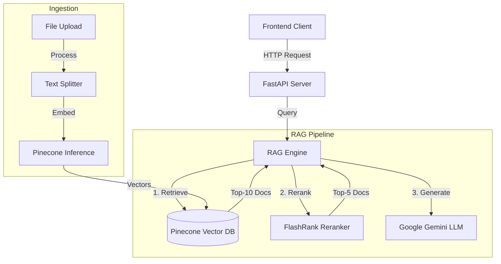

# DJ Rag Backend

The backend service for the DJ Rag application, a powerful Retrieval-Augmented Generation (RAG) system built with FastAPI and LangChain.

[**🔌 Live API**](https://djragbackend.onrender.com/docs) | [**📂 GitHub Repository**](https://github.com/DJ-InfinityCoder/RagBackend)

## 🏗️ Architecture



## 🛠️ Tech Stack

- **Framework**: [FastAPI](https://fastapi.tiangolo.com/)
- **LLM**: [Google Gemini 2.5 Flash](https://deepmind.google/technologies/gemini/)
- **Vector Database**: [Pinecone](https://www.pinecone.io/)
- **Orchestration**: [LangChain](https://www.langchain.com/)
- **Reranking**: [FlashRank](https://github.com/PrithivirajDamodaran/FlashRank)
- **Database**: SQLite (for session management)

## ⚙️ RAG Pipeline Details

### 1. Ingestion & Chunking
- **Chunk Size**: 4000 characters
- **Chunk Overlap**: 400 characters
- **Splitter**: `RecursiveCharacterTextSplitter`

### 2. Embeddings
- **Provider**: Pinecone Inference
- **Model**: `llama-text-embed-v2`
- **Dimensions**: 1024

### 3. Retrieval & Reranking
- **Initial Retrieval**: Top-10 documents using cosine similarity.
- **Reranking**: FlashRank reranks the top-10 to select the best 5 contexts for generation.

## 🚀 Quick Start

### Prerequisites
- Python 3.10+
- Pinecone API Key
- Google Gemini API Key

### Installation

1.  Clone the repository:
    ```bash
    git clone https://github.com/yourusername/dj-rag.git
    cd dj-rag/RagBackend
    ```

2.  Create a virtual environment:
    ```bash
    python -m venv venv
    source venv/bin/activate  # On Windows: venv\Scripts\activate
    ```

3.  Install dependencies:
    ```bash
    pip install -r requirements.txt
    ```

4.  Set up environment variables (`.env`):
    ```env
    GOOGLE_API_KEY=your_google_api_key
    PINECONE_API_KEY=your_pinecone_api_key
    PINECONE_INDEX_NAME=djrag
    ```

5.  Run the server:
    ```bash
    python main.py
    ```
    The API will be available at `http://localhost:8000`.
    Live API Documentation: `https://djragbackend.onrender.com/docs`

## 👨‍💻 Author

**Dilip**

- [Portfolio](https://dilip.live)
- [LinkedIn](https://www.linkedin.com/in/dilip-maurya-58252a236/)
- [Resume](https://drive.google.com/file/d/1sjZU4XBlfpP_mToazGgdlv-J-odBw7pd/view)
